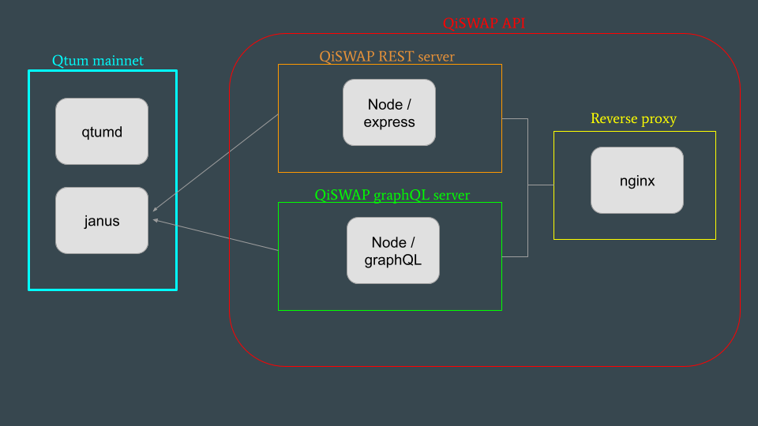
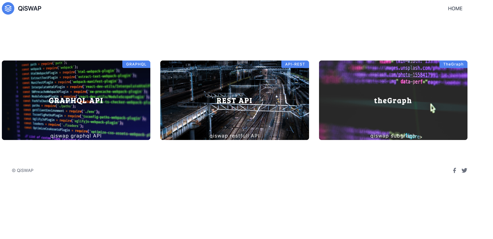
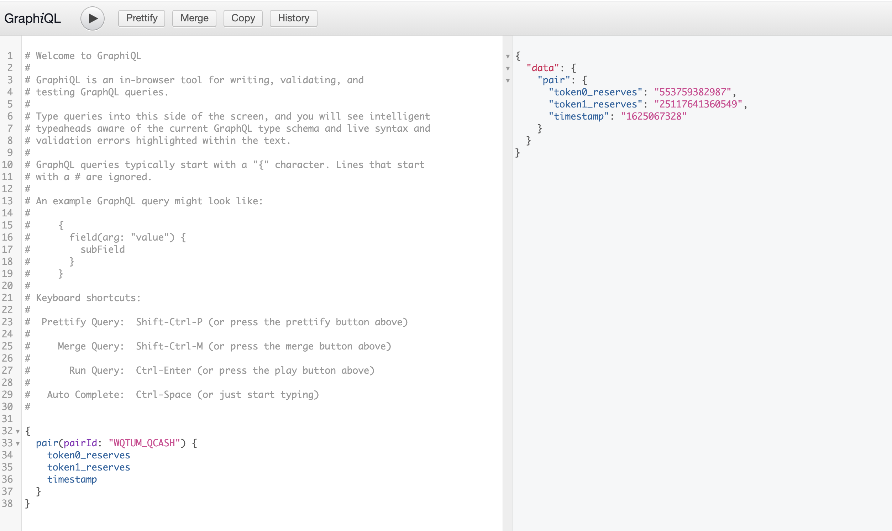
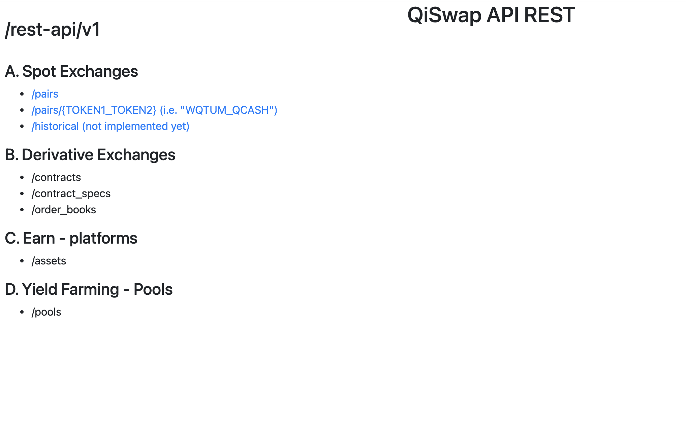

# QiSWAP API

## Live deployment

http://testnet-api.qiswap.com/


## Rest endpoints deployed

|  End Point | Description   |
|---|---|
| /pairs  | List pairs deployed on Qiswap  |
| /pairs/:pair   | Returns available data for a specific pair, i.e. *pairs/QI_WQTUM*  |

## Overview

### a. Folder structure

```javascript
docker // docker-compose file  
graphql-api  // API graphql backend implementation
homepage  // hugo.io app and static files for homepage
nginx  // nginx reverse proxy server
rest-api  // API rest backend implementation
utils // QiSWAP ABIs, conntants and config files
```

### b. Architecture



### c. Screenshots

URL: http://testnet-api.qiswap.com/



URL: http://testnet-api.qiswap.com/graphql-api/v1/



URL: http://testnet-api.qiswap.com/rest-api/v1/




## Pre-requisites
Janus and Qtumd containers must be up and running on the same host where the API is deployed

## Usage

1. Clone the repository
2. Run script to update docker-compose file with localhost ip address to access Janus

```bash
cd docker
./setup.sh
```

3. Start QiSwap API containers


```bash
docker-compose --build up -d
``` 

## Miscelaneous

### 1. Updates to homepage static files

Homepage static files are handled via gohugo.io

To update the homepage:
```bash
cd homepage
hugo -D
```
